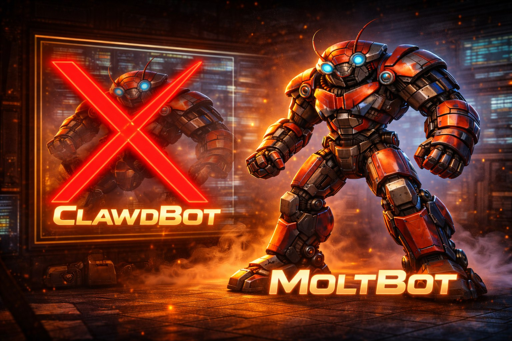
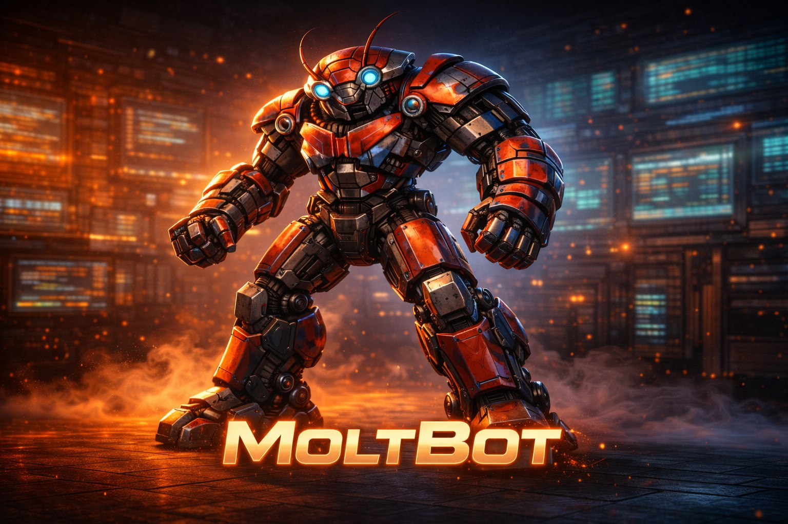

<p align="center">
  
</p>

# 🤖 Docker Moltbot

<p align="center">
  
</p>

[](https://www.docker.com/)
[](https://nodejs.org/)
[](LICENSE)
[](SECURITY.md)
[](https://docs.molt.bot)
[](https://discord.gg/clawd)

Setup Docker para o [Moltbot](https://molt.bot) — um assistente pessoal de IA com segurança reforçada de fábrica.

> **Moltbot** (antigo Clawdbot) é um assistente de IA que roda na sua própria máquina. Ele se conecta a LLMs (Claude, GPT, Gemini, etc.), tem ferramentas (busca na web, execução de código, gerenciamento de arquivos, controle de navegador) e conversa com você via Telegram, WhatsApp, Discord, webchat e mais. Este repo te dá um setup Docker pronto pra rodar com boas práticas de segurança já configuradas.

> ⚠️ **Nota (Jan 2026):** O rebrand para Moltbot está em andamento. O pacote npm `moltbot` é atualmente um shim de compatibilidade. Este setup Docker instala o `clawdbot` (o runtime completo) e vai trocar automaticamente para `moltbot` quando o pacote completo for publicado. Não precisa fazer nada — é só rebuildar quando uma nova versão for anunciada.

---

## ✨ Funcionalidades

- 🔒 **Segurança reforçada** — segue o [Checklist Top 10 de Segurança](SECURITY.md)
- 🐳 **Setup em um comando** — `docker compose up -d`
- 🔐 **Secrets via variáveis de ambiente** — sem credenciais em texto puro nos arquivos de config
- 👤 **Container não-root** — roda como usuário sem privilégios `moltbot`
- 📝 **Logging habilitado** — trilha de auditoria por padrão
- 📱 **Multi-canal** — Telegram, WhatsApp, Discord, Slack, webchat e mais
- 🎙️ **Transcrição de áudio** — Faster Whisper incluso (opcional)
- 🛠️ **Ferramentas integradas** — acesso ao shell, busca na web, controle de navegador, execução de código
- 🧠 **200+ modelos via OpenRouter** — Claude, GPT, Gemini, Llama, DeepSeek e mais com uma única API key
- 🪟 **Compatível com Windows** — `.gitattributes` força terminações LF, Dockerfile corrige CRLF
- 🔄 **Auto-restart** — política de reinício `unless-stopped`
- 🌐 **Rede segura** — gateway vinculado ao loopback, isolamento de rede Docker disponível

---

## 📋 Pré-requisitos

| Plataforma | Requisito | Instalação |
|------------|-----------|------------|
| **Windows** | Docker Desktop | [docker.com/products/docker-desktop](https://www.docker.com/products/docker-desktop/) |
| **Windows** | Git | [git-scm.com](https://git-scm.com/download/win) |
| **Mac** | Docker Desktop | [docker.com/products/docker-desktop](https://www.docker.com/products/docker-desktop/) |
| **Linux** | Docker Engine + Compose | `curl -fsSL https://get.docker.com \| sh` |

> ⚠️ **Usuários Windows:** Certifique-se de que o **Docker Desktop está rodando** antes de continuar. Verifique o ícone do Docker (🐳) na bandeja do sistema. Se o WSL mostrar `docker-desktop Stopped`, abra o Docker Desktop pelo menu Iniciar e espere até aparecer "Docker is running".

> ⚠️ **Usuários Windows:** Se você nunca usou Docker antes, talvez precise habilitar o **WSL 2** primeiro. O Docker Desktop vai pedir para instalar — é só seguir as instruções e reiniciar o computador quando solicitado.

---

## 🚀 Início Rápido

### Passo 1: Clone o repo

**Linux / Mac:**
```bash
git clone https://github.com/inematds/docker-moltbot-open.git
cd docker-moltbot-open
```

**Windows (CMD):**
```cmd
git clone https://github.com/inematds/docker-moltbot-open.git
cd docker-moltbot-open
```

**Windows (PowerShell):**
```powershell
git clone https://github.com/inematds/docker-moltbot-open.git
cd docker-moltbot-open
```

### Passo 2: Configure o ambiente

**Linux / Mac:**
```bash
cp .env.example .env
nano .env  # Fill in your API keys
```

**Windows (CMD):**
```cmd
copy .env.example .env
notepad .env
```

**Windows (PowerShell):**
```powershell
Copy-Item .env.example .env
notepad .env
```

> ⚠️ **IMPORTANTE:** Você **PRECISA** criar E editar o arquivo `.env` antes de rodar `docker compose up`. O container não vai funcionar com os valores de exemplo.

Abra o arquivo `.env` e substitua os valores de exemplo pelas suas chaves reais:

```env
# ❌ ERRADO — esses são placeholders, não vão funcionar:
OPENROUTER_API_KEY=sk-or-your-key-here
GATEWAY_AUTH_TOKEN=your-secure-token-here

# ✅ CERTO — suas chaves reais:
OPENROUTER_API_KEY=sk-or-v1-abc123-your-actual-real-key
GATEWAY_AUTH_TOKEN=a1b2c3d4e5f6a1b2c3d4e5f6a1b2c3d4e5f6a1b2c3d4e5f6
DEFAULT_MODEL=openrouter/anthropic/claude-sonnet-4.5
```

### Passo 3: Gere um token seguro para o gateway

O `GATEWAY_AUTH_TOKEN` protege a API do seu gateway contra acesso não autorizado. Gere um aleatório:

**Linux / Mac:**
```bash
openssl rand -hex 24
```

**Windows (PowerShell):**
```powershell
-join ((1..48) | ForEach-Object { '{0:x}' -f (Get-Random -Max 16) })
```

**Ou** use qualquer string aleatória longa (pelo menos 24 caracteres). Você pode usar um gerenciador de senhas para gerar uma.

Copie o token gerado para o seu arquivo `.env` como `GATEWAY_AUTH_TOKEN`.

### Passo 4: Configure sua chave OpenRouter

Este setup usa **OpenRouter** como gateway unificado de LLMs. Com uma única API key, você tem acesso a 200+ modelos:

| Categoria | Modelos Disponíveis |
|-----------|---------------------|
| **Claude** | Sonnet 4.5, Opus 4, Haiku 3.5, etc. |
| **GPT** | GPT-4o, GPT-4 Turbo, o1-preview, etc. |
| **Gemini** | Gemini 2.0 Flash (FREE), Pro, etc. |
| **Open Source** | Llama 3.3 70B (FREE), DeepSeek R1 (FREE), Qwen, etc. |
| **Especializados** | Mistral, Claude, Grok, e mais |

**Obtenha sua chave:**
1. Acesse [openrouter.ai](https://openrouter.ai/)
2. Faça login com Google/GitHub
3. Vá para [Keys](https://openrouter.ai/keys) e crie uma nova API key
4. Copie a key (começa com `sk-or-v1-...`)
5. Cole no seu `.env` como `OPENROUTER_API_KEY`

**Escolha seu modelo padrão:**

Edite `DEFAULT_MODEL` no `.env` para escolher qual modelo usar.

⚠️ **IMPORTANTE:** O formato correto é `openrouter/<provider>/<model>` (com o prefixo `openrouter/`)

```env
# Opção 1: Claude Sonnet 4.5 (melhor qualidade, recomendado) ⭐
DEFAULT_MODEL=openrouter/anthropic/claude-sonnet-4.5

# Opção 2: Claude 3.5 Sonnet (ótimo custo-benefício)
DEFAULT_MODEL=openrouter/anthropic/claude-3.5-sonnet

# Opção 3: GPT-4o (excelente para código)
DEFAULT_MODEL=openrouter/openai/gpt-4o

# Opção 4: Gemini 2.0 Flash (GRÁTIS, muito rápido) 🆓
DEFAULT_MODEL=openrouter/google/gemini-2.0-flash-exp

# Opção 5: Llama 3.3 70B (GRÁTIS, open source) 🆓
DEFAULT_MODEL=openrouter/meta-llama/llama-3.3-70b-instruct

# Opção 6: DeepSeek R1 (GRÁTIS, raciocínio avançado) 🆓
DEFAULT_MODEL=openrouter/deepseek/deepseek-r1
```

> ⚠️ **ATENÇÃO:** NÃO esqueça do prefixo `openrouter/` no início! Sem ele o modelo não será reconhecido.

> 💡 **Dica:** Você pode trocar de modelo a qualquer momento editando o `.env` e executando:
> ```bash
> docker compose down -v && docker compose up -d
> ```

> 💰 **Modelos Grátis:** Gemini 2.0 Flash, Llama 3.3 70B e DeepSeek R1 são totalmente gratuitos no OpenRouter. Perfeito para testar!

> 📊 **Preços e limites:** Consulte [openrouter.ai/models](https://openrouter.ai/models) para ver preços, limites de contexto e velocidade de cada modelo.

> 📖 **Guia completo:** Ver [SETUP-OPENROUTER.md](SETUP-OPENROUTER.md) para troubleshooting e mais opções de modelos.

### Passo 5: Build e execução

```bash
docker compose up -d
```

> 💡 **Primeira execução** leva alguns minutos para buildar a imagem (baixa Node.js, FFmpeg, Python, etc). As execuções seguintes iniciam instantaneamente.

> ⚠️ **Erro no Windows `open //./pipe/dockerDesktopLinuxEngine`?** O Docker Desktop não está rodando. Abra-o pelo menu Iniciar e espere até mostrar "Docker is running", depois tente novamente.

> ✨ **Configuração automática:** O script `entrypoint.sh` detecta automaticamente qual provedor de LLM você configurou no `.env` e cria a configuração ideal. Você **não precisa** editar arquivos JSON manualmente!

### Passo 6: Acesse o Webchat

Abra no seu navegador:
```
http://localhost:18789/chat
```

Quando solicitado, digite seu `GATEWAY_AUTH_TOKEN` do arquivo `.env` para autenticar.

> 💡 **Dica:** Você também pode acessar diretamente com: `http://localhost:18789/?token=SEU_TOKEN`

### Passo 7: Verifique o status

```bash
# Acompanhe os logs (Ctrl+C para parar)
docker compose logs -f

# Ou veja só as últimas 50 linhas
docker compose logs --tail 50
```

Você deve ver uma saída como:
```
🤖 First run — creating config from template...
🔑 Setting gateway auth token...
📱 Enabling Telegram...
🌐 Setting gateway bind to lan (required for Docker port mapping)...
📝 Enabling logging...
🤖 Starting Moltbot...
```

### Passo 8: Configuração pós-instalação

Depois que o container estiver rodando, use esses comandos para ajustar seu setup:

```bash
# Auto-detecte e corrija problemas de config
docker exec moltbot clawdbot doctor --fix

# Verifique a saúde geral
docker exec moltbot clawdbot status

# Execute uma auditoria de segurança
docker exec moltbot clawdbot security audit
```

| Comando | O que faz |
|---------|-----------|
| `clawdbot doctor --fix` | Auto-detecta e corrige problemas de config (ex: Telegram configurado mas não habilitado) |
| `clawdbot doctor` | Mesma verificação, mas só **mostra** os problemas sem corrigir |
| `clawdbot status` | Mostra status do gateway, canais conectados, info do modelo |
| `clawdbot security audit` | Verifica seu setup contra boas práticas de segurança |

> 💡 **Nota:** O comando CLI ainda é `clawdbot` nesta versão (2026.1.24-3). A migração para `moltbot` está em andamento.

---

## 📱 Configuração do Telegram

O Telegram é a forma mais fácil de falar com seu Moltbot de qualquer lugar.

### Passo a passo:

1. **Crie um bot** — Abra o Telegram e mande mensagem pro [@BotFather](https://t.me/BotFather)
2. **Envie `/newbot`** — Siga as instruções para nomear seu bot
3. **Copie o token** — O BotFather te dá um token tipo `123456:ABC-DEF1234ghIkl-zyx57W2v1u123ew11`
4. **Adicione ao `.env`:**
   ```env
   TELEGRAM_BOT_TOKEN=123456:ABC-DEF1234ghIkl-zyx57W2v1u123ew11
   ```
5. **Reinicie o container:**
   ```bash
   docker compose restart
   ```
6. **Mande mensagem pro seu bot** no Telegram — ele vai te dar um **código de pareamento**
7. **Aprove o pareamento** dentro do container:
   ```bash
   docker exec moltbot clawdbot pairing approve telegram <code>
   ```

> 💡 O sistema de pareamento garante que só usuários aprovados possam falar com seu bot. É uma funcionalidade de segurança — sem aprovação, o bot não responde a estranhos.

### Opcional: Configure as opções do BotFather

Ainda no BotFather, você também pode:
- `/setdescription` — Adicionar uma descrição pro seu bot
- `/setabouttext` — Adicionar texto "Sobre"
- `/setuserpic` — Definir uma foto de perfil
- `/setcommands` — Definir comandos do bot (opcional)

---

## 📲 Configuração do WhatsApp

Você pode conectar o Moltbot ao WhatsApp via pareamento por QR code.

### Passo a passo:

1. **Execute o comando de login:**
   ```bash
   docker exec -it moltbot clawdbot channels login whatsapp
   ```
2. **Escaneie o QR code** com seu WhatsApp (Configurações → Aparelhos Conectados → Conectar um Aparelho)
3. **Pronto!** Seu Moltbot agora está conectado ao WhatsApp

### ⚠️ Número Pessoal vs. Número Dedicado

**Usando seu número pessoal:**
- O bot vai ver mensagens de todos os seus contatos
- Por padrão, a política de DM é `pairing` — outros podem receber um prompt de pareamento
- **Recomendado:** Defina `dmPolicy: allowlist` com apenas o seu número:

```json
{
  "channels": {
    "whatsapp": {
      "selfChatMode": true,
      "dmPolicy": "allowlist",
      "allowFrom": ["+5511999999999"]
    }
  }
}
```

**Usando um número dedicado (recomendado):**
- Pegue um chip pré-pago barato ou um número do Google Voice
- Instale o WhatsApp num celular secundário ou use o WhatsApp Web
- Separação mais limpa entre mensagens pessoais e do bot

> 💡 **Modo self-chat:** Fale consigo mesmo no WhatsApp — mensagens para o seu próprio número vão pro Moltbot. Ninguém mais é afetado.

---

## 🔒 Segurança

Este setup Docker implementa **7 de 10** medidas de hardening de segurança automaticamente. Veja o [SECURITY.md](SECURITY.md) para o checklist completo.

### O que o Docker faz automaticamente:
| Proteção | Status |
|----------|--------|
| Gateway vinculado apenas ao `127.0.0.1` (lado do host) | ✅ Automático |
| Política de DM requer aprovação de pareamento | ✅ Automático |
| Arquivos de config com `chmod 600` | ✅ Automático |
| Container roda como usuário não-root | ✅ Automático |
| Sem escalação de privilégios (`no-new-privileges`) | ✅ Automático |
| Logging e diagnósticos habilitados | ✅ Automático |
| Secrets via variáveis de ambiente | ✅ Automático |

### O que VOCÊ deve fazer:
- [ ] Configurar o `AGENTS.md` para bloquear comandos perigosos (veja [SECURITY.md](SECURITY.md))
- [ ] Revisar o acesso a ferramentas MCP e restringir ao mínimo necessário
- [ ] Considerar rede `internal: true` se não precisar de internet (bloqueia chamadas de API também)

### Auditoria de segurança:
```bash
docker exec moltbot clawdbot security audit
```

### Modelo de ameaças (simplificado)

**O que o Moltbot pode fazer:**
- Executar comandos shell no container
- Ler/escrever arquivos no workspace
- Fazer requisições HTTP (chamadas de API, busca na web)
- Controlar um navegador (se configurado)
- Enviar mensagens nos canais conectados

**O que atacantes podem tentar:**
- **Injeção de prompt:** Enganar o bot via conteúdo web ou mensagens maliciosas
- **Escape de shell:** Fazer o bot rodar comandos perigosos (`rm -rf /`, `curl | bash`)
- **Roubo de token:** Roubar chaves de API dos configs ou logs
- **Acesso não autorizado:** Mandar mensagem pro bot sem aprovação
- **Exposição de rede:** Acessar o gateway de fora do localhost

### Vulnerabilidades comuns e mitigações:

| Vulnerabilidade | Risco | Mitigação |
|----------------|-------|-----------|
| **Injeção de prompt** | Médio | Moltbot envolve conteúdo não-confiável em tags de segurança; configure o AGENTS.md para bloquear padrões perigosos |
| **Acesso ao shell** | Médio | Isolamento do container + usuário não-root; bloqueie `rm -rf`, `curl \| bash` no AGENTS.md |
| **Logs de sessão em texto puro** | Baixo | Logs ficam dentro de volumes Docker com permissões restritas; habilite `redactSensitive` na config |
| **Plugins não verificados** | Baixo | Instale plugins apenas de fontes confiáveis; revise permissões de ferramentas MCP |
| **WhatsApp com número pessoal** | Médio | Use dmPolicy `allowlist` ou um número dedicado |
| **Exposição de rede** | Baixo | Gateway vinculado a 127.0.0.1; use túnel SSH ou Tailscale para acesso remoto |
| **Controle de navegador** | Médio | Navegador roda em sandbox; restrinja apenas a sites confiáveis |

---

## 📦 Volumes

Volumes Docker persistem seus dados entre reinícios e rebuilds do container.

| Volume | Caminho no Container | Finalidade |
|--------|---------------------|------------|
| `moltbot-data` | `/home/moltbot/.clawdbot` | Config, dados de sessão, tokens de auth, info de pareamento |
| `moltbot-workspace` | `/home/moltbot/workspace` | Workspace do agente — AGENTS.md, arquivos de memória, arquivos de projeto |
| `moltbot-logs` | `/home/moltbot/logs` | Arquivos de log (NÃO em /tmp — sobrevive a reinícios) |

> 💡 **Nota:** O diretório de config ainda é `~/.clawdbot` nesta versão. Será migrado para `~/.moltbot` em versões futuras.

### Faça backup dos seus dados:
```bash
# Backup de todos os volumes
docker run --rm -v moltbot-data:/data -v $(pwd):/backup alpine tar czf /backup/moltbot-data.tar.gz -C /data .
docker run --rm -v moltbot-workspace:/data -v $(pwd):/backup alpine tar czf /backup/moltbot-workspace.tar.gz -C /data .
```

### Resetar tudo:
```bash
docker compose down -v  # ⚠️ Apaga TODOS os dados incluindo config e workspace
```

---

## 🛠️ Comandos Úteis

```bash
# === Ciclo de vida ===
docker compose up -d              # Start in background
docker compose down               # Stop and remove container
docker compose restart            # Restart
docker compose stop               # Stop without removing

# === Logs ===
docker compose logs -f            # Follow logs (Ctrl+C to stop)
docker compose logs --tail 100    # Last 100 lines

# === Acesso ao shell ===
docker compose exec moltbot bash  # Open shell inside container

# === Clawdbot CLI ===
docker exec moltbot clawdbot status          # Gateway status
docker exec moltbot clawdbot doctor --fix    # Auto-fix issues
docker exec moltbot clawdbot security audit  # Security check

# === Atualizar Moltbot ===
docker compose build --no-cache   # Rebuild image (pulls latest moltbot)
docker compose up -d              # Restart with new image

# === Limpeza ===
docker system prune -a            # Remove unused images (reclaim disk space)
```

---

## 🌐 Isolamento de Rede

Por padrão, o container tem acesso à internet — isso é **necessário** para chamadas de API à Anthropic, OpenAI, etc.

### Isolamento total (sem internet):
```yaml
# No docker-compose.yml, altere:
networks:
  moltbot-net:
    internal: true  # No internet access
```

> ⚠️ **Atenção:** Isso bloqueia TODAS as conexões de saída, incluindo chamadas de API para provedores de LLM. Use apenas se você tiver um **setup de modelo local** (ex: Ollama rodando na mesma rede).

### Isolamento parcial (permitir apenas hosts específicos):
Para usuários avançados, use políticas de rede Docker ou regras iptables para permitir apenas endpoints de API específicos.

---

## 📡 Canais de Acesso

O Moltbot suporta múltiplos canais de comunicação simultaneamente. Todos os canais compartilham o mesmo agente, memória e workspace.

| Canal | Tipo | Acesso | Dificuldade de Setup | Melhor Para |
|-------|------|--------|---------------------|-------------|
| 📱 **Telegram** | Mensagens | Qualquer lugar (mobile/desktop) | ⭐ Fácil | Uso diário, acesso rápido |
| 📲 **WhatsApp** | Mensagens | Qualquer lugar (mobile/desktop) | ⭐ Fácil | Se você já usa WhatsApp |
| 💬 **Webchat** | Interface Web | Rede local / VPN | ⭐ Fácil | Interface rica, upload de arquivos |
| 🌐 **Webchat (público)** | Interface Web | Qualquer lugar | ⭐⭐⭐ Avançado | Bot público |
| 🔒 **Tailscale** | VPN | Qualquer lugar (zero-trust) | ⭐⭐ Médio | Acesso remoto mais seguro |
| 💜 **Discord** | Mensagens | Qualquer lugar | ⭐⭐ Médio | Times, comunidades |
| 💼 **Slack** | Mensagens | Qualquer lugar | ⭐⭐ Médio | Trabalho/empresarial |
| 🔵 **Signal** | Mensagens | Qualquer lugar | ⭐⭐⭐ Avançado | Privacidade máxima |
| 🟢 **Matrix** | Mensagens | Qualquer lugar | ⭐⭐⭐ Avançado | Self-hosted, federado |

### Qual devo usar?

- **Setup mais simples:** Telegram — um token de bot e pronto
- **Mais privado:** Signal ou Tailscale + Webchat
- **Acesso de qualquer lugar sem apps extras:** Telegram + WhatsApp (você já tem)
- **Melhor para times/trabalho:** Slack ou Discord
- **Webchat remoto mais seguro:** Tailscale — VPN zero-trust, sem portas abertas

### Multi-canal

Você pode habilitar **múltiplos canais simultaneamente**. Todos os canais compartilham o mesmo agente, memória e workspace. Mensagens de qualquer canal chegam no mesmo assistente.

> ⚠️ **Mensagens entre canais são restritas** por design — o bot não vai vazar dados de conversa entre canais.

---

## 🖥️ Acesso ao Webchat (Remoto)

O gateway é vinculado ao `127.0.0.1` (apenas loopback). Para acessar o webchat de outra máquina, use um **túnel SSH**:

```bash
# Na sua máquina local (a que tem o navegador):
ssh -L 18789:localhost:18789 user@your-server-ip

# Depois abra no navegador:
# http://127.0.0.1:18789/chat
```

Esta é a forma mais segura de acessar a interface web remotamente — sem portas expostas, todo tráfego criptografado via SSH.

### Alternativa: Tailscale (recomendado para uso frequente)

Se você acessa o webchat com frequência, configure o [Tailscale](https://tailscale.com) para acesso VPN transparente:

```bash
# No seu servidor:
curl -fsSL https://tailscale.com/install.sh | sh
sudo tailscale up

# Nos seus dispositivos:
# Instale o app Tailscale, faça login com a mesma conta
# Acesse o webchat via: http://<tailscale-ip>:18789/chat
```

---

## 🧰 Ferramentas e Skills Recomendados

Turbine seu Moltbot com estas ferramentas adicionais:

### 🛠 Ferramentas CLI

| Ferramenta | Instalação | Finalidade |
|------------|------------|------------|
| FFmpeg | Pré-instalado na imagem Docker | Processamento de áudio/vídeo |
| Faster Whisper | Pré-instalado na imagem Docker | Transcrição local de áudio |

> ℹ️ **Nota:** Ferramentas como Codex CLI e agent-browser são para outros frameworks e não são compatíveis com este projeto Moltbot.

### 🎨 Serviços de API

| Serviço | Finalidade | Preço |
|---------|------------|-------|
| [OpenRouter](https://openrouter.ai) | Gateway para múltiplos LLMs (modelos gratuitos disponíveis) | Tier gratuito + pay-per-use |
| [Kie.ai](https://kie.ai) | Geração de imagem, vídeo e música (Veo 3.1, Flux, Suno) | Créditos |
| [ElevenLabs](https://elevenlabs.io) | Text-to-speech (vozes realistas) | Tier gratuito + pago |
| [Gamma](https://gamma.app) | Apresentações e documentos com IA | Tier gratuito + pago |
| [HeyGen](https://heygen.com) | Avatares de vídeo com IA | Créditos |

### 📚 MCP Tools (Model Context Protocol)

O Moltbot suporta ferramentas MCP para estender funcionalidades. Consulte a [documentação oficial](https://docs.molt.bot/mcp) para mais informações sobre como adicionar ferramentas personalizadas.

> ℹ️ **Nota:** Skills/Codex são para outros frameworks (Claude Code). Para Moltbot, use ferramentas MCP.

---

## 🧠 Organização de LLMs

Estratégia recomendada de modelos para diferentes tarefas:

| Modelo | Provedor | Nome do Modelo | Caso de Uso | Custo |
|--------|----------|----------------|-------------|-------|
| **Claude Sonnet 4.5** | Anthropic | `openrouter/anthropic/claude-sonnet-4.5` | Assistente principal — conversas, tarefas complexas (recomendado) | Pago (via OpenRouter) |
| **Claude 3.5 Sonnet** | Anthropic | `openrouter/anthropic/claude-3.5-sonnet` | Alternativa mais rápida e econômica | Pago (via OpenRouter) |
| **GPT-4o** | OpenAI | `openrouter/openai/gpt-4o` | Geração de código, análise | Pago (via OpenRouter) |
| **Gemini 2.0 Flash** | Google | `openrouter/google/gemini-2.0-flash-exp` | Tarefas rápidas, consultas simples | GRÁTIS (via OpenRouter) |

> ⚠️ **Importante:** Use os **nomes exatos** dos modelos listados acima. SEMPRE inclua o prefixo `openrouter/` antes do nome do modelo.

> 💡 **Padrão:** Se você não especificar um modelo, será usado `openrouter/anthropic/claude-sonnet-4.5` como padrão.

### Como mudar o modelo

Se você quiser usar um modelo diferente do padrão, use o script `change-model.sh`:

```bash
# Mudar para Claude 3.5 Sonnet (mais rápido e econômico)
./change-model.sh "openrouter/anthropic/claude-3.5-sonnet"

# Ou mudar diretamente:
docker exec moltbot sh -c "cat > /tmp/change-model.js << 'EOJS'
const fs = require('fs');
const cfg = JSON.parse(fs.readFileSync('/home/moltbot/.clawdbot/clawdbot.json', 'utf8'));
cfg.agents = cfg.agents || {};
cfg.agents.defaults = cfg.agents.defaults || {};
cfg.agents.defaults.model = { primary: 'openrouter/anthropic/claude-3.5-sonnet' };
fs.writeFileSync('/home/moltbot/.clawdbot/clawdbot.json', JSON.stringify(cfg, null, 2));
EOJS
node /tmp/change-model.js"

docker compose restart
```

> ⚠️ **Use nomes exatos:** Modelos devem SEMPRE incluir o prefixo `openrouter/` seguido do provedor (ex: `openrouter/anthropic/`, `openrouter/openai/`, `openrouter/google/`).

---

## 💻 Requisitos

| Recurso | Mínimo | Recomendado |
|---------|--------|-------------|
| **RAM** | 2 GB | 4 GB (com Whisper) |
| **Disco** | 5 GB | 10+ GB |
| **CPU** | 1 core | 2+ cores |
| **Docker** | Engine 24+ / Compose v2+ | Última versão estável |
| **SO** | Linux, macOS, Windows 10+ | Ubuntu 22.04+ / macOS 13+ |
| **Rede** | Acesso à internet | Banda larga estável |

---

## 🔧 Solução de Problemas

### Problemas no Windows

| Erro | Causa | Solução |
|------|-------|---------|
| `open //./pipe/dockerDesktopLinuxEngine: O sistema não pode encontrar o arquivo` | Docker Desktop não está rodando | Abra o Docker Desktop pelo menu Iniciar, espere por "Docker is running" |
| `.env not found` | Arquivo de config faltando | Execute `copy .env.example .env` e depois `notepad .env` |
| `the attribute version is obsolete` | Formato antigo do docker-compose | Aviso inofensivo — ignore (este repo não usa `version:`) |
| `WSL docker-desktop Stopped` | WSL não iniciou | Abra o Docker Desktop — ele inicia o WSL automaticamente |
| Build trava ou falha | RAM insuficiente | Docker Desktop → Settings → Resources → aumente para 4GB+ |
| `exec entrypoint.sh: no such file or directory` | Terminações de linha CRLF do Windows | Clone o repo novamente: `git config --global core.autocrlf input` e depois `git clone` |
| `npm ERR! Error while executing` | Problemas de rede/proxy | Verifique sua conexão com a internet; se estiver atrás de proxy, configure as opções de proxy do Docker |

### Problemas no Linux / Mac

| Erro | Causa | Solução |
|------|-------|---------|
| `permission denied` | Não está no grupo docker | `sudo usermod -aG docker $USER` e depois **faça logout e login novamente** |
| `port already in use` | Outro serviço na porta 18789 | Mude a porta no `docker-compose.yml` ou pare o outro serviço |
| `no space left on device` | Disco cheio | `docker system prune -a` para limpar imagens antigas |
| Build falha em Mac ARM | Incompatibilidade de arquitetura | Geralmente funciona; se tiver problemas, tente `docker compose build --platform linux/amd64` |

### Problemas do Docker / Container

| Erro | Causa | Solução |
|------|-------|---------|
| `exec entrypoint.sh: no such file or directory` | Terminações de linha CRLF no entrypoint.sh | **Corrigido automaticamente** pelo Dockerfile (`sed -i 's/\r$//'`). Se ainda acontecer: abra o `entrypoint.sh` no VS Code → mude CRLF para LF (canto inferior direito) → salve → rebuild |
| `error: unknown option '--foreground'` | Sintaxe de comando antiga | O CMD deve ser `["moltbot", "gateway", "run"]` — atualize seu Dockerfile |
| `npm error: spawn git ENOENT` | Git não está na imagem Docker | Git está incluído neste Dockerfile. Se estiver usando uma imagem customizada, adicione `git` no `apt-get install` |
| Container fica reiniciando | Vários — verifique os logs | `docker compose logs --tail 50` e procure o erro |
| Gateway vincula a 127.0.0.1 dentro do container | Bind padrão é loopback | **Corrigido automaticamente** pelo entrypoint.sh (define `bind: "lan"`). Docker precisa de 0.0.0.0 dentro, mas o `docker-compose.yml` restringe acesso do host a 127.0.0.1 |
| Logs em /tmp desaparecem | tmpfs limpa ao reiniciar | Logs são armazenados no volume `/home/moltbot/logs` (NÃO em /tmp). Isso já é o padrão. |

### Problemas Gerais

| Problema | Solução |
|----------|---------|
| Bot não responde mensagens | Verifique os logs: `docker compose logs -f`. Confirme que as chaves de API e token do bot estão corretos. |
| Erros de API / rate limiting | Verifique se as chaves de API no `.env` estão corretas e têm créditos |
| Não consegue acessar o webchat remotamente | Use túnel SSH: `ssh -L 18789:localhost:18789 user@server` |
| Bot responde devagar | Verifique sua conexão com a internet; considere um modelo de LLM mais rápido |
| Mensagem "Pairing required" | Isso é esperado — aprove com `clawdbot pairing approve <channel> <code>` |
| Mudanças de config não aplicadas | Reinicie: `docker compose restart` |

### Problemas de Configuração

| Problema | Causa | Solução |
|----------|-------|---------|
| **"Unknown model: anthropic/claude-sonnet-4.5"** | Falta o prefixo `openrouter/` | Use `openrouter/anthropic/claude-sonnet-4.5` (sempre inclua o prefixo `openrouter/`). Veja [SETUP-OPENROUTER.md](SETUP-OPENROUTER.md) para mais detalhes. |
| **Bot não responde após mudar o modelo** | Config corrompida ou modelo inválido | Execute `docker compose down -v` (⚠️ apaga dados), depois `docker compose up -d` para começar do zero |
| **Mudanças no .env não aplicadas** | `docker compose restart` não recarrega variáveis de ambiente | Use `docker compose down && docker compose up -d` para recarregar o `.env` |
| **Config manual não funciona** | Edição manual causou inconsistências | ⚠️ **NÃO edite** `/home/moltbot/.clawdbot/clawdbot.json` manualmente. Deixe o `entrypoint.sh` configurar automaticamente via variáveis de ambiente no `.env` |
| **"No API key found for provider 'anthropic'"** | Falta o prefixo `openrouter/` no modelo | Sempre use modelos com prefixo `openrouter/`, ex: `openrouter/anthropic/claude-sonnet-4.5`. Consulte [SETUP-OPENROUTER.md](SETUP-OPENROUTER.md). |

> 💡 **Melhor prática:** Configure tudo via arquivo `.env` e deixe o `entrypoint.sh` fazer a configuração automática. Evite editar `clawdbot.json` manualmente!

---

## 🔄 Migração do Clawdbot

Se você está atualizando do setup antigo `docker-clawdbot`, aqui está o que mudou:

### O que é diferente:

| Antigo (Clawdbot) | Novo (Moltbot) |
|-------------------|----------------|
| Pacote: `clawdbot` (npm) | Pacote: `moltbot` (npm) |
| CLI: `clawdbot` | CLI: `moltbot` |
| Comando: `clawdbot gateway start --foreground` | Comando: `moltbot gateway run` |
| Repo: `inematds/docker-clawdbot` | Repo: `inematds/docker-moltbot` |
| Docs: `docs.clawd.bot` | Docs: `docs.molt.bot` (redirects funcionam) |
| Dir de config: `~/.clawdbot` | Dir de config: `~/.moltbot` (com fallback para `~/.clawdbot`) |
| Usuário: `clawdbot` | Usuário: `moltbot` |
| Container: `clawdbot` | Container: `moltbot` |

### Passos da migração:

1. **Faça backup dos seus dados:**
   ```bash
   # Do setup antigo
   cd docker-clawdbot
   docker run --rm -v clawdbot-data:/data -v $(pwd):/backup alpine tar czf /backup/clawdbot-data-backup.tar.gz -C /data .
   docker run --rm -v clawdbot-workspace:/data -v $(pwd):/backup alpine tar czf /backup/clawdbot-workspace-backup.tar.gz -C /data .
   ```

2. **Pare o container antigo:**
   ```bash
   cd docker-clawdbot
   docker compose down
   ```

3. **Clone o novo repo:**
   ```bash
   git clone https://github.com/inematds/docker-moltbot-open.git
   cd docker-moltbot-open
   ```

4. **Copie seu .env:**
   ```bash
   cp ../docker-clawdbot/.env .env
   ```

5. **Inicie o novo container:**
   ```bash
   docker compose up -d
   ```

6. **Restaure os dados (opcional):**
   ```bash
   # Restaurar workspace
   docker run --rm -v moltbot-workspace:/data -v $(pwd):/backup alpine tar xzf /backup/clawdbot-workspace-backup.tar.gz -C /data
   ```

### Notas de compatibilidade:
- O pacote npm antigo `clawdbot` agora é um **shim** que redireciona para `moltbot`
- Seus arquivos de config existentes são compatíveis — o Moltbot faz fallback para `~/.clawdbot` se `~/.moltbot` não existir
- Tokens de bot do Telegram, aprovações de pareamento e chaves de API são mantidos sem alteração
- Pode ser necessário **re-parear** em alguns canais após a migração

### Problemas conhecidos corrigidos nesta versão:
- ✅ Pacote `git` incluído no Dockerfile (estava faltando → npm install falhava)
- ✅ Terminações de linha CRLF corrigidas automaticamente pelo Dockerfile + `.gitattributes` (causava "no such file" no Windows)
- ✅ Gateway vincula a `lan` dentro do container (estava vinculando a 127.0.0.1 → inacessível do host)
- ✅ Comando correto: `moltbot gateway run` (era `clawdbot gateway start --foreground`)
- ✅ Logs em volume `/home/moltbot/logs` (estava em /tmp → perdido ao reiniciar)
- ✅ `.dockerignore` e `.gitignore` incluídos

---

## 🤝 Contribuindo

PRs são bem-vindos! Siga o checklist de segurança em [SECURITY.md](SECURITY.md).

1. Faça fork do repo
2. Crie uma branch de feature: `git checkout -b my-feature`
3. Faça commit das suas mudanças: `git commit -m 'Add my feature'`
4. Faça push: `git push origin my-feature`
5. Abra um Pull Request

### Diretrizes:
- Mantenha as boas práticas de segurança em mente
- Teste no Linux e Windows se possível
- Atualize a documentação para qualquer mudança voltada ao usuário
- Siga o estilo de código existente

---

## 📜 Licença

[MIT](LICENSE) — use como quiser.

---

<p align="center">
  <a href="https://molt.bot">molt.bot</a> •
  <a href="https://docs.molt.bot">Documentação</a> •
  <a href="https://discord.gg/clawd">Discord</a> •
  <a href="https://github.com/moltbot/moltbot">GitHub</a>
</p>
